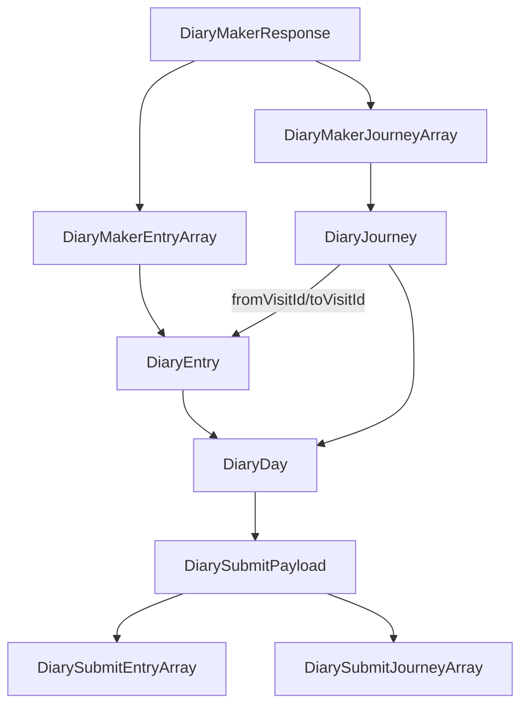

# location-tracker

`location-tracker` is an iOS app that captures location + motion data, builds daily diary visits/journeys through Supabase functions, and collects user confirmations before final submission.

## Architecture Overview

- **Capture layer**: `LocationService` listens for `CLLocation` and `CMMotionActivity` updates and forwards normalized data to networking.
- **Diary generation**: Supabase `diary-maker` builds visits and journeys for a given `deviceId` + `date`.
- **Local-first diary state**: `DiaryService` loads/saves `DiaryDay` via `DiaryStorage` and preserves in-progress answers.
- **Submission**: `DiaryService` maps local models into `DiarySubmitPayload` and posts to `diary-submit`.
- **Post-submit lifecycle**: successful submissions are tracked by date; local day data is deleted.

## Core Entities

### Server DTOs (from `diary-maker`)

- `DiaryMakerResponse`: wrapper containing `visits` and `journeys`.
- `DiaryMakerEntry`: raw visit cluster fields from backend.
- `DiaryMakerJourney`: raw journey segment fields from backend.

### Local App Models

- `DiaryEntry`: visit cluster + user answers (`confirmedPlace`, `confirmedActivity`, `userContext`).
- `DiaryJourney`: journey segment + user answer (`confirmedTransport`, `travelReason`).
- `DiaryDay`: per-device, per-date aggregate (`entries` + `journeys`) used for persistence and submission.

### Submission Models (to `diary-submit`)

- `DiarySubmitPayload`: top-level submit body for one day.
- `DiarySubmitEntry`: user-confirmed visit answers.
- `DiarySubmitJourney`: user-confirmed journey answers.

## Entity Relationships

## Data Flow

1. App captures location + motion and uploads telemetry.
2. For a selected day, app calls `diary-maker` with `deviceId` and `date`.
3. Response DTOs are mapped into local `DiaryEntry`/`DiaryJourney`.
4. If local data already exists, items are merged by id and previous answers are preserved.
5. User completes questionnaire fields in UI.
6. App submits `DiarySubmitPayload` to `diary-submit`.
7. On success, app records date as submitted and deletes local `DiaryDay`.

## State and Ownership

- **Supabase-owned**: generated visits and journeys (source clusters and transport inference).
- **Device-owned (until submit)**: questionnaire progress and completion state.
- **Submission guard**: submitted dates are cached locally to avoid duplicate prompts/posts.

## Configuration

### iOS build-time values (`.xcconfig` / Info.plist)

These keys are read by `Environment`:

- `API_KEY`: Supabase key used for edge function authorization.
- `ENDPOINT`: Supabase functions base URL (for example `https://<project>.supabase.co/functions/v1/`).
- `HOME_LOCK_PASSWORD`: app admin/home lock password.

### Supabase / functions environment

- `MAPS_API`: Google Maps API key with Places API enabled.

## Development Setup

1. Install Supabase CLI or use an existing Supabase project.
2. Authenticate with Supabase:
   - `supabase login`
3. Add required app keys to your local `.xcconfig`/plist-backed config for Xcode builds.
4. Add function env keys in Supabase console or `supabase/functions/.env` for local function runs.

## Code Commenting Standard

Use this style across Swift files:

- **Doc comments (`///`)** on types and non-trivial methods:
  - purpose of the symbol
  - ownership/source of truth
  - important side effects
- **`// MARK:` sections** to group behavior (loading, mapping, networking, lifecycle).
- **Inline comments** only for non-obvious decisions and invariants, not for obvious syntax.
- Prefer comments that explain **why** and **constraints**, not what a line already says.

Example checks for service/model comments:

- What invariant must remain true?
- What happens on failure?
- Which layer owns this data?
- What mapping contract is assumed between DTO and local model?

## Documentation Update Checklist

When changing features, models, or flows:

- [ ] Updated doc comments for changed types/methods.
- [ ] Updated README architecture/entities/data-flow if behavior changed.
- [ ] Updated relationship notes when ids or links change.
- [ ] Updated config docs when keys/endpoints change.
